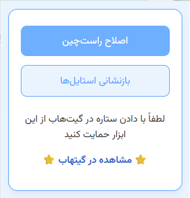

<p align="center">
  <h1 align="center">DeepSeek RTL Fixer | افزونه اصلاح نمایش فارسی در دیپسیک</h1>
</p>

سلام! 👋  
اگر با [DeepSeek](https://deepseek.com) به زبان فارسی کار می‌کنید، احتمالاً متوجه بهم‌ریختگی متن‌ها و ترکیب عجیب راست‌چین و چپ‌چین شده‌اید 😵‍💫  
این افزونه‌ی کوچک، دقیقاً برای حل همین مشکل ساخته شده است.

## ✨ قابلیت‌ها

- ✅ راست‌چین کردن خودکار متن‌های فارسی
- ✅ اصلاح خودکار فونت متن‌های فارسی
- ✅ حفظ چپ‌چین بودن بلوک‌های کد
- ✅ فعال سازی با یک کلیک
- ✅ قابلیت برگشت به حالت اولیه
- ✅ نصب آسان بدون نیاز به Chrome Web Store
- ✅ کاملاً متن‌باز (Open Source)

## 🔧 نصب افزونه در Chrome

۱. ابتدا [آخرین نسخه را از GitHub](https://github.com/MatinGhanbari/deepseek-rtl-fixer/releases) دانلود کرده و فایل ZIP را استخراج کنید.

۲. مرورگر Google Chrome را باز کرده و وارد آدرس زیر شوید:

```

chrome://extensions

```

۳. حالت **Developer Mode** (بالا سمت راست) را فعال کنید.

۴. روی دکمه **Load unpacked** کلیک کنید.

۵. پوشه‌ای را که فایل `manifest.json` در آن قرار دارد انتخاب کنید.

۶. آیکون افزونه باید در نوار بالا ظاهر شود ✅

## 🚀 نحوه استفاده

۱. وارد سایت [deepseek.com](https://deepseek.com) شوید  
۲. روی آیکون افزونه کلیک کنید  
۳. دکمه `اصلاح راست‌چین` را بزنید.  
۴. از تجربه‌ای تمیز و مرتب با متن فارسی لذت ببرید! 😄

## 📸 تصاویر افزونه

<p align="right">
  
</p>

## 🔄 بروزرسانی افزونه

در صورت انتشار نسخه جدید:

1. به آدرس `chrome://extensions` بروید
2. برروی افزونه کلیک کنید و دکمه **Details** را بزنید.
3. نسخه قبلی را با کلیک روی **Update** آپدیت کنید

> [!IMPORTANT] 
> 🔍 حتماً فایل `manifest.json` را بررسی کنید تا مطمئن شوید نسخه جدیدتری نصب کرده‌اید.

## ⭐️ حمایت

اگر مفید بود، با یک ⭐️ در GitHub از پروژه حمایت کنید 🙏

## 📄 مجوز

این پروژه تحت مجوز [MIT License](LICENSE) منتشر شده است.  
استفاده، توسعه و انتشار آزاد با ذکر منبع مجاز است.
